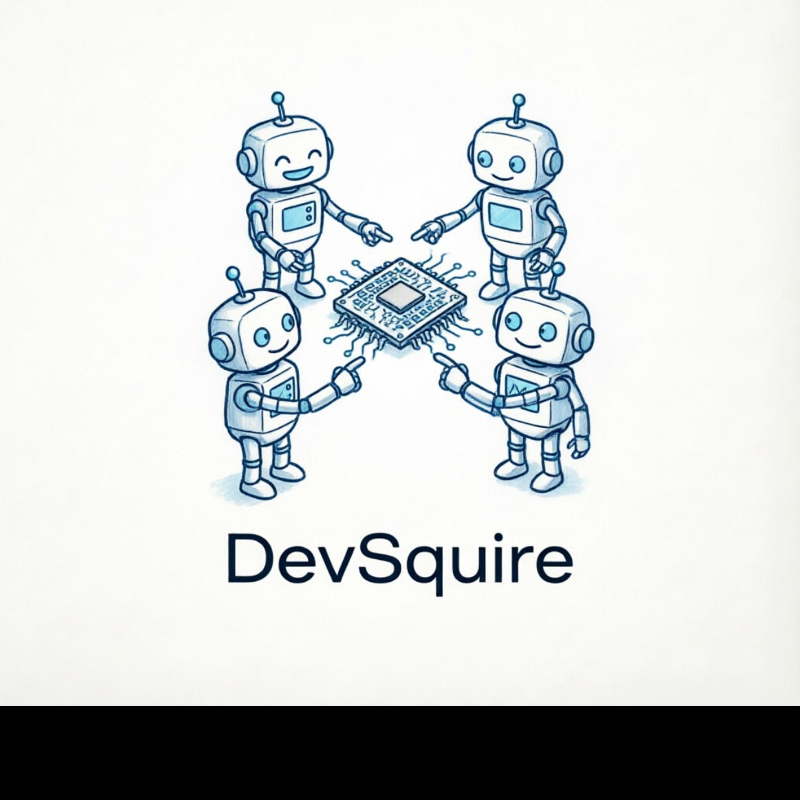
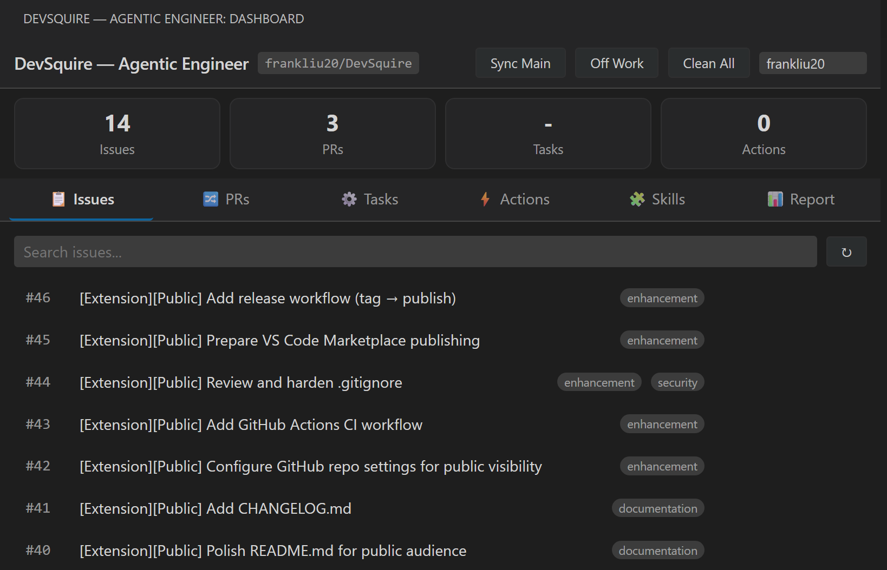
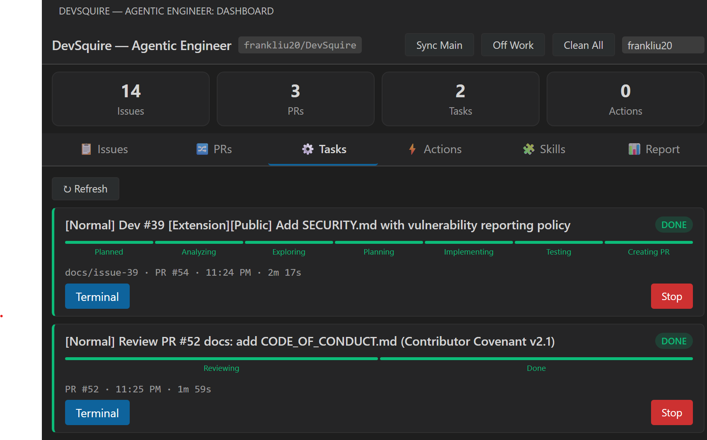
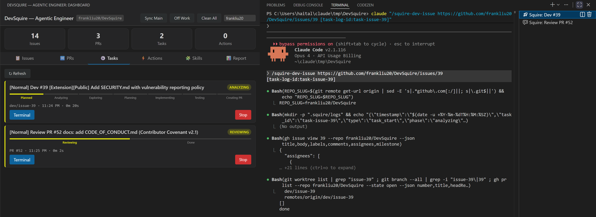
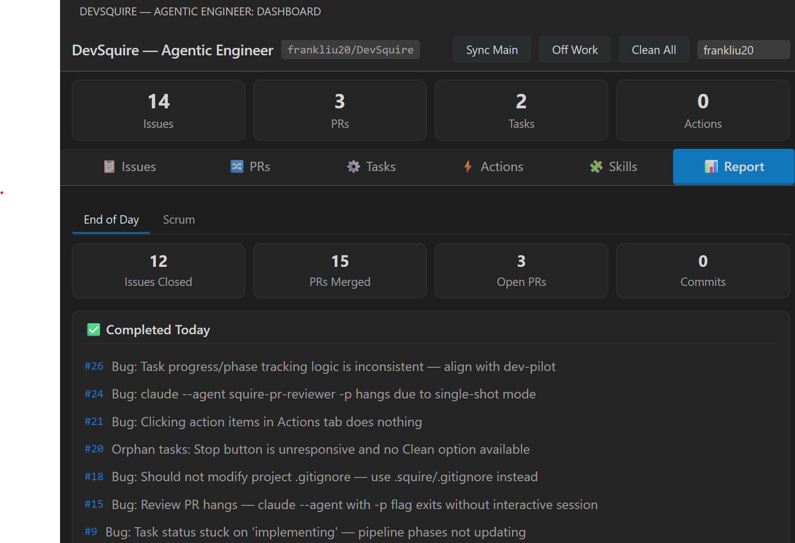

<p align="center">
  
</p>

<h1 align="center">DevSquire — Agentic Engineer</h1>

<p align="center">
  <strong>One developer + DevSquire = a full engineering team.</strong><br/>
  Autonomously develops issues, reviews PRs, monitors CI — all from VS Code.
</p>

<p align="center">
  <a href="https://github.com/frankliu20/DevSquire/actions/workflows/ci.yml"></a>
  <a href="https://github.com/frankliu20/DevSquire/blob/main/LICENSE"></a>
  <a href="https://github.com/frankliu20/DevSquire/releases"></a>
</p>

<p align="center">
  English | <a href="./README.zh-CN.md">中文</a>
</p>

---

> **Stop context-switching. Start shipping.** DevSquire is an AI-powered engineering dashboard that turns GitHub issues into pull requests, reviews code with configurable strategies, and monitors your CI pipeline — while you focus on what matters.

## Why DevSquire?

| | Traditional AI Tools | DevSquire |
|---|---|---|
| **Workflow** | Copy-paste between chat and IDE | End-to-end autonomous pipeline |
| **Issue → PR** | Manual: read issue, plan, code, test, push | One click: analyze → plan → implement → test → create PR |
| **Code Review** | Generic suggestions | Structured review with severity levels and auto-publish |
| **CI Monitoring** | Manual checks and fixes | Auto-detect failures, auto-fix, auto-push |
| **Visibility** | Black box | Real-time dashboard with pipeline progress |

## Core Features

🚀 **Develop Issues** — Point at a GitHub issue, sit back and watch. DevSquire analyzes the issue, explores the codebase, plans a solution, implements it, runs tests, and creates a PR — all autonomously.

🔍 **Review PRs** — Structured code review with three strategies: `normal` (interactive), `auto` (publish immediately), `quick-approve` (approve or block). Configurable severity filtering (high / medium / low).

👁️ **Watch PRs** — Continuous monitoring of your open PRs. Auto-detects CI failures and review comments. Optionally auto-fixes and pushes — so your PRs stay green.

📊 **Dashboard** — Real-time pipeline visualization for every task. Six tabs: Issues, PRs, Tasks, Actions, Skills, and Report. One-click actions for everything.

📋 **End-of-Day Report** — Generate a scrum-style summary: issues closed, PRs merged, open work. Perfect for standups.

## Screenshots

### Dashboard — Issue Management
Browse and develop GitHub issues directly from the dashboard.



### Task Pipeline — Real-Time Progress
Every task shows a live progress pipeline. Dev issues go through 7 stages; PR reviews through 3.



### Agent at Work — Terminal Integration
Tasks run in VS Code terminals. Click **Terminal** to see the AI agent working in real time.



### End-of-Day Report
Generate a daily scrum summary with one click.



## Quick Start

### Install

Search **DevSquire** in the VS Code Extensions Marketplace, or:

```bash
code --install-extension frankliu20.devsquire-vscode
```

### Prerequisites

- [GitHub CLI](https://cli.github.com/) (`gh`) installed and authenticated
- One of the supported AI backends:
  - [Claude Code](https://docs.anthropic.com/en/docs/claude-code) CLI — `claude` command
  - [GitHub Copilot CLI](https://docs.github.com/en/copilot/github-copilot-in-the-cli) — `gh copilot` command

> DevSquire works with both platforms. Switch anytime via `devSquire.aiPlatform` setting.

## How It Works

```
GitHub Issue ──► DevSquire Dashboard ──► AI Agent in Terminal
                        │                        │
                        │  real-time progress     │  autonomous pipeline
                        │  pipeline tracking      │  analyze → plan → code → test
                        │                        │
                        ▼                        ▼
                 Tasks Tab (live)          Pull Request Created
```

**Task Pipelines:**

| Task Type | Pipeline |
|-----------|----------|
| Dev Issue | `Analyzing → Exploring → Planning → Implementing → Testing → Creating PR` |
| Review PR | `Reviewing → Done → Published` |
| Watch PR | `Monitoring ↔ Fixing CI ↔ Fixing Comments` (cyclic) |

## Settings

| Setting | Default | Description |
|---------|---------|-------------|
| `devSquire.aiPlatform` | `claude-code` | AI platform (`claude-code` or `copilot-cli`) |
| `devSquire.agentConfigLocation` | `home` | Agent install location: `home` (~/.claude/) or `project` |
| `devSquire.autoSyncAgentConfig` | `true` | Auto-sync agents on activation |
| `devSquire.devIssue.mode` | `auto` | `normal` (pause for approval) or `auto` (fully autonomous) |
| `devSquire.reviewPR.mode` | `normal` | `normal`, `auto`, or `quick-approve` |
| `devSquire.reviewPR.level` | `medium` | Review detail: `high`, `medium`, or `low` |
| `devSquire.watchPR.autoFixCI` | `true` | Auto-fix CI failures |
| `devSquire.watchPR.autoFixComments` | `false` | Auto-fix review comments |

## License

[MIT](LICENSE) — build something great with it.
